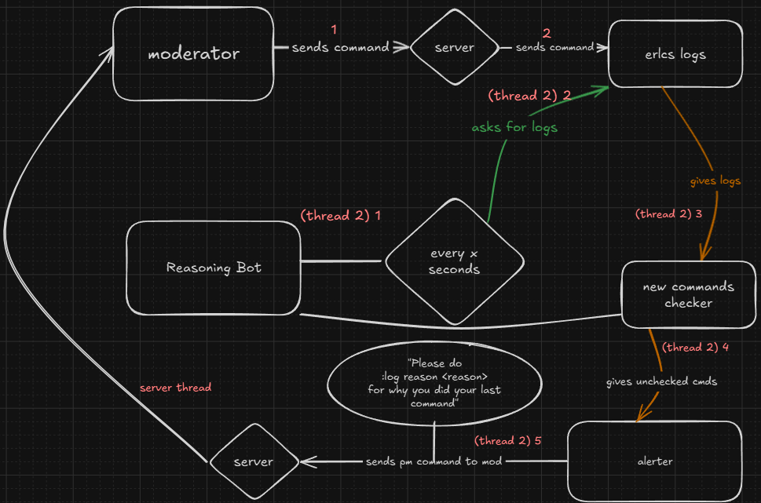

<h1 align="center">Reasoning</h1>

  

  

  

  

**summary:**
When a moderator sends a command. It expects them to add a reaason (for example, :load <user> <reason> or :kick <user> <reason>)
Because ER:LC doesn't natively alert or enforce a reason. That's what this does.
**If a moderator sends a command, without a reason, they will get alerted, and it will get logged.**

Additionally, you can enable **after-logging** which lets the moderator run the command :log reason <reason> to make up.
